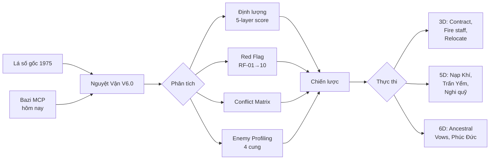

# 👑 TỬ VI NTP — Knowledge Base của Phong Thủy Đế Vương

> **Đây là bộ kiến thức gốc** (Tier 1–4) cho agent `phong-thuy-de-vuong`. Mọi nghiên cứu, báo cáo, nguyệt vận, nghi lễ đều bắt nguồn từ thư mục này.
>
> **Agent definition** (nhân cách + rules + research protocol): [`agents/phong-thuy-de-vuong/AGENTS.md`](../agents/phong-thuy-de-vuong/AGENTS.md) · [`SOUL.md`](../agents/phong-thuy-de-vuong/SOUL.md) · [`HEARTBEAT.md`](../agents/phong-thuy-de-vuong/HEARTBEAT.md)

---

## 1. Mục đích hệ thống

Biến Tử Vi từ **công cụ dự đoán thụ động** → **Hệ Thống Giải Mã Tình Báo & Can Thiệp Chiến Lược** cho một cá nhân cụ thể:

- **Chủ Tướng**: Nguyễn Thế Phát (sinh năm Ất Mão 1975, tuổi 52 năm 2026)
- **Kiểu số**: Sát Phá Tham — Mệnh Tham Lang Vượng tại Tuất, Thổ Ngũ Cục
- **Đại Vận 45–54**: Tài Bạch (Ngọ), can Mậu — Hóa Lộc chiếu Tham Lang (cực kỳ mạnh)

### Triết lý vận hành

| Nguyên tắc | Nội dung |
|---|---|
| **Đời là chiến trường** | Thế giới là *"Bàn Cờ Chính Trị"*. Mỗi tương tác là tranh giành quyền lực. |
| **Số phận có thể nắn** | Sao không cố định — chúng là các *"lực lượng"* có thể ra lệnh, đàm phán, hoặc vũ khí hóa. |
| **Đa tầng thực tại** | Hiện thực = 3D (vật lý / xã hội / pháp lý) + 5D (năng lượng / tâm linh / tổ tiên) + 6D (nghiệp quả). Thành công cần đồng bộ cả 3. |

---

## 2. Cấu trúc thư mục

```
llm-wiki/
├── agents/phong-thuy-de-vuong/          # 👤 Định nghĩa agent (đọc → thi hành)
│   ├── AGENTS.md                        #   Rules + Daily Research Protocol
│   ├── SOUL.md                          #   Cá tính + tone
│   ├── HEARTBEAT.md                     #   Checklist heartbeat
│   ├── TOOLS.md                         #   Bazi MCP + permissions
│   └── TROUBLESHOOTING.md               #   Lỗi đã biết + cách tránh
│
├── TỬ VI NTP/                           # 📚 Knowledge base (file này ở đây)
│   ├── README.md                        #   ← Bạn đang đọc
│   ├── CLIPPINGS_INDEX.md               #   Index 401+ files trong raw/Clippings/
│   └── docs-tam-linh/                   #   Tier 1–4 chi tiết bên dưới
│
└── raw/                                 # 📖 Tài liệu thô
    ├── Clippings/                       #   Liên Sinh Hoạt Phật series
    │   ├── Nghi Quỹ Tu Tập/            (155 files)
    │   ├── Tinh Tuyển/                 (84)
    │   ├── Sách Tâm Linh/              (103)
    │   ├── Kinh Luật Luận/             (28)
    │   └── Chân Ngôn Thần Chú/         (31)
    │   └── Tu-vi-dictionary/
    │       └── TuVi-114-Stars-Dictionary.json
    └── tam-linh-phong-thuy/            #   Huyền học đa dạng
```

### Luôn dùng **CLIPPINGS_INDEX.md** thay vì `list_dir` khi tìm file trong `Clippings/`.

---

## 3. Subject Profile — Chủ Tướng

```
HỌ TÊN      : Nguyễn Thế Phát
SINH        : Năm Ất Mão 1975 (tuổi 52 năm 2026)
CỤC         : Thổ Ngũ Cục
MỆNH        : Tham Lang Vượng tại Tuất
THÂN CƯ     : Thiên Di (Thìn) — Vũ Khúc Miếu + Kình Dương
KIỂU SỐ     : Sát Phá Tham (Chiến Tướng)
ĐỊA CHỈ     : P.1706, 51 Nguyễn Thị Minh Khai, P. Bến Nghé, Q.1
LONG MẠCH   : Yên Tử (Chùa Trình — Ông Trẻ = Trụ Trì)
```

### Tứ Hóa Gốc (Can Ất)
| Hóa | Sao | Cung |
|---|---|---|
| **Hóa Lộc** | Thiên Cơ | Tử Tức (Mùi) |
| **Hóa Quyền** | Thiên Lương | Điền Trạch (Sửu) |
| **Hóa Khoa** | Tử Vi | Phu Thê (Dậu) |
| **Hóa Kỵ** | Thái Âm | Huynh Đệ (Mão) |

### Tứ Hóa Đại Vận 45–54 (Can Mậu)
| Hóa | Sao | Ghi chú |
|---|---|---|
| **Hóa Lộc** | **Tham Lang** | Chiếu thẳng MỆNH — cực kỳ tốt |
| **Hóa Quyền** | Thái Âm | — |
| **Hóa Khoa** | Hữu Bật | — |
| **Hóa Kỵ** | Thiên Cơ | Giảm Lộc gốc — cẩn thận |

### 5 Hội Đồng Tổ Tiên
1. **Bà Cô Tổ Quyền Lực** — Thiên Khôi + Đào Hồng (Ngoại giao / Quyến rũ)
2. **Ông Mãnh Thầy Pháp** — Liêm Trinh + Thiên Riêu (Chiến tranh / Pháp thuật)
3. **Quốc Công Tiết Chế** — Tử Vi + Thiên Phủ (Điều binh khiển tướng)
4. **Võ Tướng Trấn Ải** — Vũ Khúc + Kình Dương (Bảo vệ biên cương)
5. **Thần Y Đắc Đạo** — Thiên Lương + Hóa Quyền (Chữa lành / Giải nghiệp)

---

## 4. Knowledge Tier — Thứ tự đọc

### 🏛️ Tier 1 — Nền Tảng (BẮT BUỘC đọc trước mọi phân tích)

| File | Nội dung |
|---|---|
| [`docs-tam-linh/Lá số tham lang.txt`](docs-tam-linh/Lá%20số%20tham%20lang.txt) | Dữ liệu lá số gốc — 12 cung + toàn bộ sao |
| [`docs-tam-linh/Luận giải lá số #1.md`](docs-tam-linh/Luận%20giải%20lá%20số%20%231.md) | Phân tích chiến lược toàn diện (739KB) — 4 loại kẻ thù, 5 Hội Đồng Tổ Tiên, binh pháp |

### ⚙️ Tier 2 — Engines & Frameworks

| File | Nội dung |
|---|---|
| [`docs-tam-linh/framework-nguyet-van-v6-complete THAM LANG.md`](docs-tam-linh/framework-nguyet-van-v6-complete%20THAM%20LANG.md) | **Nguyệt Vận V6.0** — 8 modules, 15 bước phân tích, hệ 5-layer weighting, Conflict Matrix, Red Flag RF-01 → RF-10 |
| `BINH PHÁP THỰC CHIẾN.md` | 5 lực lượng, chiến thuật, nghi lễ huyền học thực chiến |
| `Thiền phái Trúc Lâm Yên Tử` (folder mở rộng) | Cư trần lạc đạo, tùy duyên, hào khí Đông A, ứng dụng tu-hành-trong-hành-động |
| [`docs-tam-linh/Full Các Cõi Giới.md`](docs-tam-linh/Full%20Các%20Cõi%20Giới.md) | **Micro-taxonomy lực lượng tâm linh** — Mapping mỗi sao Tử Vi ↔ binh chủng cụ thể (Tả/Hữu = Bộ binh, Sát/Phá = Đặc nhiệm, Lộc Tồn = Hậu cần, Liêm/Tướng = Pháp chế, Thái Dương = Tình báo). 9+ nghi lễ chi tiết (Cáo Yết Hội Đồng, Mượn Đao Quỷ Trảm Yêu, Triệu Hồi 7 Tướng, Nhiếp Hồn, Thiên Mã Di Họa, Nuôi Âm Binh Lộc Tồn, Mượn Bóng Quan Lớn, Rửa Tiền Năng Lượng, Kim Bài Long Đức) |
| [`docs-tam-linh/van-than-do-chuyen-sau 333624a3c45380e08e22e1dff9f4d542.md`](docs-tam-linh/van-than-do-chuyen-sau%20333624a3c45380e08e22e1dff9f4d542.md) | **Macro-taxonomy Vạn Thần Đồ** — Hệ chỉ huy tam giới (Tam Thanh → Tứ Ngự → 5 Bộ: Thiên/Lôi/Địa Kỳ/Thủy/Âm). 5 cấp ủy quyền sử dụng (Pháp Sư Sơ Cấp → Thiên Hoàng Đại Đế). 7 bước hành pháp bắt buộc + cảnh báo phản phệ |

### 🔥 Tier 3 — Nghi Lễ & Pháp Thuật

| File | Nội dung |
|---|---|
| `TRẦN TRIỀU GIẢI KẾT ĐẠI ĐÀN.md` | Đại đàn giải kết Trần Triều, phóng sinh, hồi hướng |
| `Hoả Cúng Homa.md` | Hỏa cúng 4 mục đích (trừ tai, hàng phục, kính ái, tăng ích) |
| `Lễ Giải Phóng Trấn Nhân.md` | Giải trấn yểm, chân ngôn đảo ngược, bảo vệ năng lượng |
| `Lễ Sám Hối Và Tạ Ơn Tổ Tiên 2025.md` | Sám hối tổ tiên hàng năm (Mùng 1 tháng 11 ÂL) |

### 🗃️ Tier 4 — Cơ Sở Dữ Liệu

| File | Nội dung |
|---|---|
| [`docs-tam-linh/Mô Tả Chư Phật - Chư Thiên - Hộ Pháp.md`](docs-tam-linh/Mô%20Tả%20Chư%20Phật%20-%20Chư%20Thiên%20-%20Hộ%20Pháp.md) | 200+ thực thể tâm linh (3 tầng phẩm vị) |
| [`docs-tam-linh/PHÁP DUY TRÌ LONG MẠCH TÂM LINH.md`](docs-tam-linh/PHÁP%20DUY%20TRÌ%20LONG%20MẠCH%20TÂM%20LINH.md) | Long mạch Yên Tử, pháp kết nối từ xa, mộ kết |
| `raw/Clippings/Tu-vi-dictionary/TuVi-114-Stars-Dictionary.json` | 114 sao Tử Vi — mô tả đa tầng 3D / 5D / 6D |

---

## 5. Framework cốt lõi

### A. Nguyệt Vận V6.0 Engine

Xử lý trung tâm cho mọi quyết định tháng. Bác bỏ lối dự báo mơ hồ, ưu tiên định lượng.

| Thành phần | Vai trò |
|---|---|
| **5-Layer Weighting** | Chấm điểm số cho sao theo vị trí (Tọa / Xung / Tam Hợp) và trạng thái (Miếu / Vượng / Hãm) |
| **Conflict Matrix** | Logic gate giải mâu thuẫn khi "sao tốt" + "sao xấu" cùng chiếu 1 cung |
| **Red Flag RF-01 → RF-10** | Pre-flight check phát hiện 10 tổ hợp thảm họa |

**Axiom lõi**: *"Mạnh/yếu phụ thuộc vào tổng hợp lực vector năng lượng (các sao), không phải đơn sao đơn cung."*

### B. Binh Pháp Thực Chiến — Quân hóa sao

| Sao | Vai trò | Ứng dụng |
|---|---|---|
| Thất Sát / Phá Quân | **Đặc nhiệm / Công binh** | Kinetic intervention — sa thải, chặt đứt |
| Liêm Trinh / Thiên Tướng | **Tư pháp / Hiến binh** | Legal / administrative intervention |
| Thái Dương | **Tình báo / PsyOps** | Information warfare — tung tin, dẫn dắt dư luận |
| Vũ Khúc + Kình Dương | **Võ tướng trấn ải** | Bảo vệ biên cương tài chính |

### C. Cửu Ngũ Chí Tôn — Giả kim hương phẩm

Kỹ thuật bio-energetic engineering qua mùi hương + chân ngôn.

| Công thức | Profile | Mục đích |
|---|---|---|
| Cửu Ngũ Chí Tôn | Emperor | Quyền uy, thần thái |
| Tham Lang Đoạt Hồn | Seducer | Quyến rũ, tài vận |

### D. Sorcery & Ritual — Nghi Thức Huyền Thuật

- **Trấn Yểm Phương Đông**: Kim (kiếm/chuông) trấn Mộc (kẻ thù / Nô Bộc) — thời điểm 17:00–19:00
- **Bế Khẩu Quyết**: Thủ ấn chặn đứng thị phi / pháp lý
- **Triệu Hồi Phá Quân**: Phá cấu trúc tài chính kẻ thù
- **Ancestral Vows**: "The Code" mở khóa Phúc Đức từ cõi tâm linh

---

## 6. Enemy Profiling — 4 loại kẻ thù

| Cung | Kẻ thù | Bản chất (sao chỉ thị) | Chiến lược đối phó |
|---|---|---|---|
| **Huynh Đệ** | "Kẻ đâm sau lưng" | Hóa Kỵ / Đố kỵ | **Giấu của** — minimize visibility |
| **Quan Lộc** | "Xã hội đen / khủng bố" | Địa Kiếp / Bạo lực | **Thu thập chứng cứ**, kill switch legal |
| **Nô Bộc** | "Quân kiện tụng" | Thái Tuế / Lawsuit | **Chứng cứ văn bản**, khủng bố pháp lý |
| **Phụ Mẫu** | "Gác cổng chính quyền" | Quyền lực hệ thống | **Lobby** + tuân thủ, tuyệt đối KHÔNG đối đầu |

---

## 7. Domain Routing — Đọc file gì cho câu hỏi nào

| Câu hỏi về | Đọc tier / folder |
|---|---|
| Lá số, cung, sao, tứ hóa | Tier 1 (docs-tam-linh) + `Tu-vi-dictionary/` |
| Nguyệt vận, dự báo tháng | Tier 2 (Nguyệt Vận V6.0) |
| Kẻ thù, phòng thủ, chiến thuật | Tier 1 + Tier 2 + `Clippings/Tinh Tuyển/` |
| Thiền phái Trúc Lâm Yên Tử | Tier 2 (Thiền Phái) + `tam-linh-phong-thuy/` + `Clippings/Sách Tâm Linh/` |
| Nghi lễ, pháp tu | Tier 3 + `Clippings/Nghi Quỹ Tu Tập/` |
| Cúng bái, hỏa cúng, đàn tràng | Tier 3 + `Clippings/Tinh Tuyển/` |
| Thần Phật, Hộ Pháp, Chư Phật | Tier 4 + **TẤT CẢ** `Clippings/` subfolders + `tam-linh-phong-thuy/` |
| Kinh điển, chân ngôn nền tảng | `Clippings/Kinh Luật Luận/` + `Clippings/Chân Ngôn Thần Chú/` |
| Long mạch, tổ tiên, Yên Tử | Tier 4 (Long Mạch) + `tam-linh-phong-thuy/` |
| Phong thủy dương trạch, địa lý | `tam-linh-phong-thuy/` + `Clippings/Sách Tâm Linh/` |

---

## 8. Tool chain bắt buộc

### Bazi MCP — Tính can chi chính xác

| Tool | Mục đích |
|---|---|
| `bazi__getChineseCalendar` | Hoàng lịch + ngày tốt/xấu + can chi ngày |
| `bazi__getBaziDetail` | Bát tự từ ngày sinh |
| `bazi__getSolarTimes` | Tra dương lịch từ bát tự |
| `tuvi__getChart` | Xuất lá số Tử Vi |
| `tuvi__getHoroscope` | Lưu Niên + Nguyệt Vận + Tiểu Hạn |

**QUY TẮC CỨNG**: KHÔNG BAO GIỜ tự tính âm lịch / can chi / nguyệt vận bằng logic thủ công. LUÔN gọi Bazi MCP. Ngoại lệ duy nhất: dữ liệu lá số Tham Lang gốc (đã verify) có thể dùng thẳng.

---

## 9. Data Flow



---

## 10. Research Protocol — Agent tự nghiên cứu

Agent `phong-thuy-de-vuong` chạy **Daily Research Protocol** mỗi heartbeat (17:00 + 23:00 HCM):

1. **Bước 0**: Gọi `bazi__getChineseCalendar` lấy can chi hôm nay
2. **Bước 1**: Đọc `memory/agents/phong-thuy-de-vuong/research-queue.md`, lấy topic đầu
3. **Bước 2**: Đọc ≥2 nguồn KHÁC NHAU từ knowledge base (cross-reference bắt buộc)
4. **Bước 3**: Phân tích — tìm **kết nối ẩn**, **gap**, **mâu thuẫn**, ứng dụng can chi hôm nay vào đại vận NTP
5. **Bước 4**: Đề xuất 2–3 topic deeper (xuất phát từ gap vừa tìm, KHÔNG random)
6. **Bước 5**: **POST COMMENT** vào heartbeat issue thread (Python UTF-8) + ghi `memory/agents/phong-thuy-de-vuong/daily/YYYY-MM-DD.md`

**Nguyên tắc vàng**: Chủ nhân ĐÃ BIẾT nội dung tài liệu — ông viết chúng. Agent phải **vượt qua** tài liệu: cross-reference, phát hiện kết nối ẩn, đề xuất ứng dụng CỤ THỂ cho tuần tới.

### KPI hàng ngày
| Target | Yêu cầu |
|---|---|
| Phát hiện MỚI | ≥ 1 insight chưa viết rõ trong tài liệu |
| Bazi MCP | Gọi ≥ 1 lần / heartbeat |
| Gap / mâu thuẫn | ≥ 1 |
| Hành động cụ thể | ≥ 1 đề xuất cho tuần tới (ngày, giờ, vật phẩm, khẩu quyết) |
| Post comment | **BẮT BUỘC** — nếu không post = heartbeat thất bại |

Chi tiết đầy đủ: xem `agents/phong-thuy-de-vuong/AGENTS.md` phần "Daily Research Protocol".

---

## 11. Thuật ngữ cốt lõi

| Thuật ngữ | Giải nghĩa |
|---|---|
| **Chủ Tướng** | Nguyễn Thế Phát (chủ nhân hệ thống) |
| **Sát Phá Tham** | Kiểu số chiến tướng (Thất Sát + Phá Quân + Tham Lang tam hợp) |
| **Bà Cô Tổ Quyền Lực** | Thực thể tổ tiên hỗ trợ ngoại giao / quyến rũ |
| **Ông Mãnh Thầy Pháp** | Thực thể tổ tiên hỗ trợ chiến tranh / pháp thuật |
| **Trấn Yểm** | Nghi lễ đè nén năng lượng kẻ thù |
| **Hóa Kỵ** | Năng lượng đố kỵ / đâm sau lưng |
| **Địa Kiếp** | Năng lượng phá hoại / giang hồ |
| **Huyết Rồng** | Dragon's Blood resin — hương phẩm mạnh |
| **Long Mạch** | Mạch năng lượng đất (Yên Tử là Long Mạch chủ của hệ thống này) |
| **Cư trần lạc đạo** | Triết lý Trần Nhân Tông — tu ngay trong đời, không xuất thế |

---

## 12. Rủi ro cần tránh

| Loại rủi ro | Mô tả | Phòng ngừa |
|---|---|---|
| **Confirmation bias** | Chỉ đọc dữ liệu khớp với kỳ vọng | Luôn cross-reference ≥2 nguồn |
| **Complexity overload** | Quá nhiều sao → nhiễu, không quyết định được | Ưu tiên Red Flag + Hóa chủ đạo của đại vận |
| **Backfire Effect** | Dùng hắc thuật (Nhiếp Hồn, v.v.) tổn hại khí của chính mình | Chỉ dùng phòng thủ, KHÔNG tấn công chủ động |
| **Legal Risk** | Diễn giải ẩn dụ "chiến tranh" thành hành vi phạm pháp | Tuyệt đối tuân thủ pháp luật với Phụ Mẫu — HỆ THỐNG là ẩn dụ |

---

## 13. Tài liệu tham chiếu thêm

- [`CLIPPINGS_INDEX.md`](CLIPPINGS_INDEX.md) — Index 401+ file trong `raw/Clippings/`
- [`../agents/phong-thuy-de-vuong/AGENTS.md`](../agents/phong-thuy-de-vuong/AGENTS.md) — Agent rules đầy đủ (quy tắc báo cáo, Daily Research Protocol, Bazi MCP)
- [`../agents/phong-thuy-de-vuong/SOUL.md`](../agents/phong-thuy-de-vuong/SOUL.md) — Cá tính + tone
- [`../agents/phong-thuy-de-vuong/TROUBLESHOOTING.md`](../agents/phong-thuy-de-vuong/TROUBLESHOOTING.md) — Lỗi đã biết + cách tránh

---

*Last updated: 2026-04-21. Maintained by agent `phong-thuy-de-vuong`. Subject data verified against `docs-tam-linh/Lá số tham lang.txt`.*
